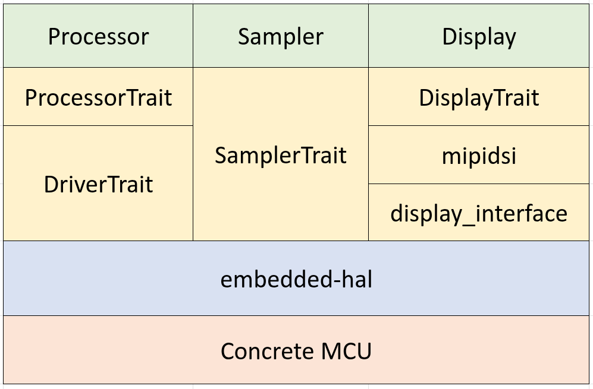

  
  
  
  

<h2 align="center">🎶 ost-pid</h2>

## 👒 Architecture 

as long as you use embedded-hal, embassy, and able to find display driver that implement embedded-graphic, you ready to build the firmware for your custom MCU/hardware. 

  

## 🎄 References

- OsPID github: https://github.com/osPID
- DualPID https://github.com/knifter/DualPID/ 
- lib-FPID https://github.com/knifter/lib-FPID/tree/master 
- [slint on mcu](https://github.com/slint-ui/slint-mcu-rust-template/tree/main)

a long project with the hope of completion. created with ♥️ by ah...

 
